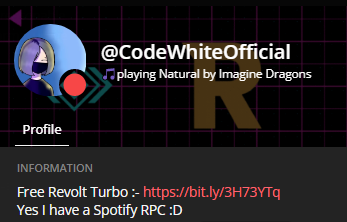

# Revolt Spotify RPC

Display what you are listening in spotify on Revolt.chat as status

## Badges

[](./LICENSE) [>)](https://img.shields.io/github/directory-file-count/CodeWhiteWeb/Revolt-Spotify-RPC)

## Run Locally

Clone the project

```bash
  git clone https://github.com/CodeWhiteWeb/Revolt-Spotify-RPC
```

Go to the project directory

```bash
  cd Revolt-Spotify-RPC
```

Install dependencies

```bash
  npm install
```

fill the `.env` file with required things

Start the server

```bash
  npm run start
```

## .ENV (environment variables)

To run this project, you will need to add the following environment variables to your `.env` file

```
spotify_username=Your Spotify Username here
api_key=Your last.fm api key here
user_token=Your Revolt User Token Here
```

### to get last.fm api follow the step

- #### create your account - https://last.fm
- #### connect you spotify account
- Go to Last.fm and log in.
- Hover over your profile image in the top-right.
- Click Settings.
- Click Applications.
- Click Connect, next to Spotify Scrobbling.
- Continue to allow access to your Spotify account.
- #### Create an api account https://www.last.fm/api/account/create ( fill fields with random things, it doesn't matter)

### to get revolt.chat user token follow the step

- #### go to app.revolt.chat (revite) and open console from developer tools ( shortcut keys - f12 or Ctrl + Shift + I)
- #### paste the following -

```js
window.state.auth.sessions.get(controllers.client.getReadyClient().user._id)
  .session.token;
```

- #### copy it without `' '`

Fill all the required fields in `.env` file and run

## Screenshots



## Author

- [@CodeWhiteWeb](https://www.github.com/CodeWhiteWeb)
